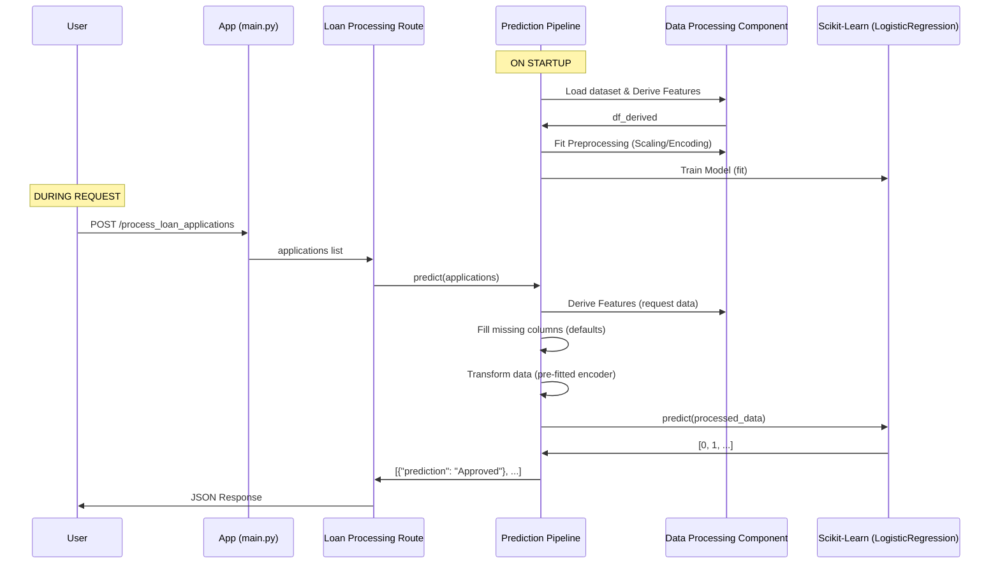

# ML Project Model & Execution Sequence

This document explains the machine learning model used in this project and the step-by-step execution flow from server startup to prediction.

---

## 🧠 Model Information

### Where is the model defined?
The model logic, training on startup, and inference code are located in:
**[`src/ml_project/pipeline/prediction.py`](file:///c:/Users/Dell/.gemini/antigravity/scratch/ml_project/src/ml_project/pipeline/prediction.py)**

### What model is used?
The project uses **[`LogisticRegression`](https://scikit-learn.org/stable/modules/generated/sklearn.linear_model.LogisticRegression.html)** from the `scikit-learn` library.

*   **Implementation:** `self.model = LogisticRegression(max_iter=1000)`
*   **Training Type:** Supervised learning for binary classification (Approved vs. Rejected).

---

## 🚀 Execution Sequence

The application follows a specific lifecycle from the moment you run the `uvicorn` command.

### 1. Server Initialization
When `uvicorn src.app.main:app` is executed:
1.  **`src/app/main.py`**: The `create_app()` function is called. It initializes the FastAPI application and installs the `loan_processing` router.
2.  **`src/app/api/loan_processing.py`**: The module is loaded. At the top level (line 7), it creates a global instance of the `PredictionPipeline`.

### 2. Pipeline Warm-up (The Training Phase)
Inside `PredictionPipeline.__init__` (in `prediction.py`):
1.  **Load Data**: It looks for `data/dataset.csv`.
2.  **Feature Engineering**: It calls `dervieSubsetFeatures` (from `data_processing.py`) to create new technical features like `FOIR_Score` and `Lending_Score`.
3.  **Preprocessing**: It calls `dataSetPreprocessing` which:
    *   Identifies categorical and numerical columns.
    *   Creates a `ColumnTransformer` (MinMaxScaler for numbers, OneHotEncoder for categories).
    *   Sets up a `KNNImputer` to handle missing data.
    *   **Fits the Preprocessor**: Learns scaling and encoding from the dataset.
4.  **Model Fitting**: The `LogisticRegression` model is trained (`self.model.fit`) on the processed data.
5.  **Compute Defaults**: It calculates column medians/modes to use as fallback values for future incomplete requests.

### 3. Inference Workflow (Request Handling)
When a user sends a `POST` request to `/process_loan_applications`:

1.  **FastAPI Validation**: The incoming JSON is validated against the `LoanApplication` model (defined in `config_entity.py`).
2.  **API Handler**: `process_loan_applications` in `loan_processing.py` receives the list of applications and calls `pipeline.predict(applications)`.
3.  **In-Pipeline Processing**:
    *   **DataFrame Conversion**: Pydantic objects are converted to a Pandas DataFrame.
    *   **Derive Features**: The same engineering logic (`dervieSubsetFeatures`) is applied to the new input.
    *   **Handle Missingness**: Any columns the model expects that weren't in the request are filled with the pre-calculated training-set defaults.
    *   **Transform**: The input is transformed using the previously fitted preprocessor (`self.pipeline.transform`).
4.  **Prediction**: The model runs `self.model.predict(X_processed)`.
5.  **Result Formatting**: The numeric 0/1 predictions are converted to "Rejected" / "Approved".
6.  **Response**: FastAPI returns the JSON response to the user.

---

## 🛠️ Key Components Interaction

